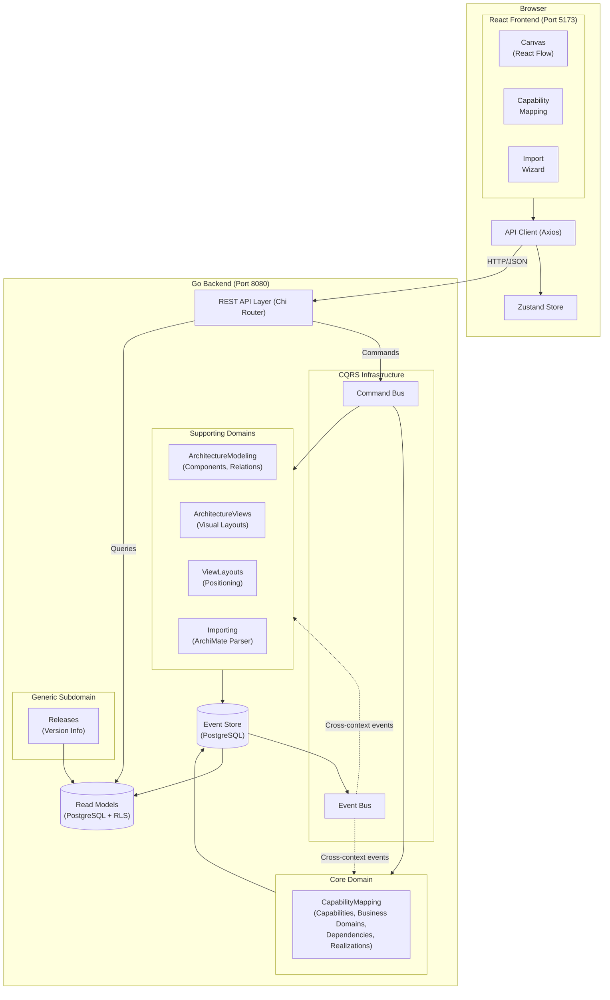

# easi - Enterprise Architecture - Simple 
Simple, modern tool for modelling, documenting and analysing enterprise architecture.

## Spec-Driven Development
All specs are in /specs. Code and documentation must follow existing specifications.

### Spec Format
All specs must contain a description and checklist:
- [ ] Specification ready
- [ ] Implementation done
- [ ] Unit tests implemented and passing
- [ ] Integration tests implemented if relevant
- [ ] Documentation updated if needed
- [ ] User sign-off

If there's no check-mark in "Specification ready", do not implement, but ask user to verify the spec first.
Update spec checklist when contributing.

### Spec Naming
- `001_ShortDescription_pending.md` - not yet implemented
- `001_ShortDescription_ongoing.md` - in development
- `001_ShortDescription_done.md` - fully implemented

## Architecture
Domain-Driven Design with CQRS and Event Sourcing for core domains.
Supporting domains can use CRUD or whatever other architecture makes sense for their purpose.

### Current Architecture Summary
The system uses event sourcing for core aggregates, REST Level 3 APIs with HATEOAS, and a clean separation between domain models and infrastructure.

### Bounded contexts
See [detailed bounded context documentation](docs/bounded-contexts/README.md).

#### ArchitectureModeling
This is a supporting domain that manages the IT application landscape - what systems exist and how they interact.

#### ArchitectureViews
This is a supporting domain that allows for visualisations of the architecture model.
A key trait of Easi is that views are separate from the model.

#### CapabilityMapping
Core domain for enterprise capability modeling. Uses CQRS with event sourcing.

**API Endpoints:**
 OpenAPI spec is available at backend/docs/docs.go and served on the backend at http://localhost:8080/swagger/index.html

### Architecture Overview



## Tech Stack
- **Backend**: Go
- **Frontend**: React, TypeScript, Vite, React Flow
- **API**: OpenAPI specifications
- **Containers**: Docker/Podman

## Prerequisites
- Docker or Podman

## Setup

### First-Time Setup
```bash
# Set up environment variables
./setup-local-env.sh

# Start database and services
docker-compose up -d
# or if using Podman
podman compose up -d
```

## Database
PostgreSQL 16

## Testing
### Running backend unit tests
```bash
cd backend
make build
make test
```

### Running backend integration tests
```bash
# Start db and run db migration
podman compose up -d
cd backend
# build and test backend
make build
./test-integration.sh
```

### Running frontend unit tests
```bash
cd frontend
npm run test
```

### Running E2E Tests
```bash
# Start the test environment
podman compose -f docker-compose.e2e.yml up -d

# Run the e2e tests
cd frontend
npm run test:e2e

# Clean up
podman compose -f docker-compose.e2e.yml down
```