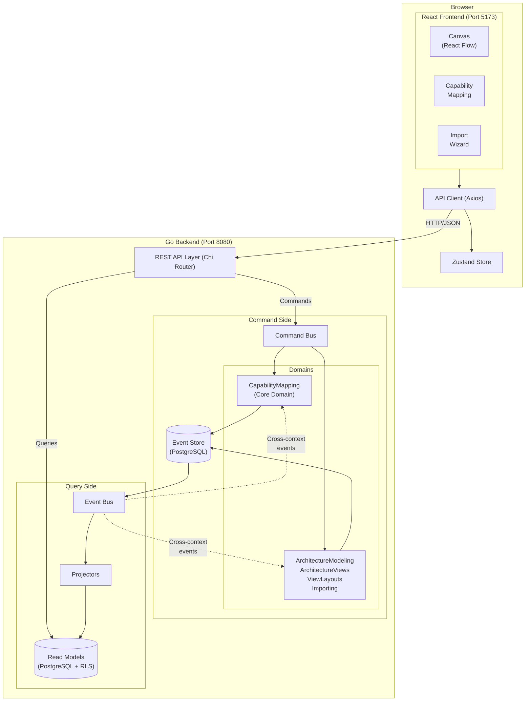

# easi - Enterprise Architecture - Simple 
Simple, modern tool for modelling, documenting and analysing enterprise architecture.

## Spec-Driven Development
All specs are in /specs. Code and documentation must follow existing specifications.

### Spec Format
All specs must contain a description and checklist:
- [ ] Specification ready
- [ ] Implementation done
- [ ] Unit tests implemented and passing
- [ ] Integration tests implemented if relevant
- [ ] Documentation updated if needed
- [ ] User sign-off

If there's no check-mark in "Specification ready", do not implement, but ask user to verify the spec first.
Update spec checklist when contributing.

### Spec Naming
- `001_ShortDescription_pending.md` - not yet implemented
- `001_ShortDescription_ongoing.md` - in development
- `001_ShortDescription_done.md` - fully implemented

## Architecture
Domain-Driven Design with CQRS and Event Sourcing for core domains.
Supporting domains can use CRUD or whatever other architecture makes sense for their purpose.

### Current Architecture Summary
The system uses event sourcing for core aggregates, REST Level 3 APIs with HATEOAS, and a clean separation between domain models and infrastructure.

### Bounded contexts
See [detailed bounded context documentation](docs/architecture/README.md).

#### ArchitectureModeling
This is a supporting domain that manages the IT application landscape - what systems exist and how they interact.

#### ArchitectureViews
This is a supporting domain that allows for visualisations of the architecture model.
A key trait of Easi is that views are separate from the model.

#### CapabilityMapping
Core domain for enterprise capability modeling. Uses CQRS with event sourcing.

**API Endpoints:**
 OpenAPI spec is available at backend/docs/docs.go and served on the backend at http://localhost:8080/swagger/index.html

### Architecture Overview


```mermaid
flowchart TB
    subgraph Browser["Browser"]
        direction LR
        subgraph Frontend["React Frontend (Port 5173)"]
            direction LR
            CanvasFeature["Canvas<br/>(React Flow)"]
            CapabilityUI["Capability<br/>Mapping"]
            ImportUI["Import<br/>Wizard"]
        end
        ApiClient["API Client (Axios)"]
        Store["Zustand Store"]
        Frontend --> ApiClient
        ApiClient --> Store
    end

    subgraph Backend["Go Backend (Port 8080)"]
        REST["REST API Layer (Chi Router)"]

        subgraph CommandSide["Command Side"]
            direction TB
            CommandBus["Command Bus"]
            subgraph Domains["Domains"]
                direction LR
                CoreDomain["CapabilityMapping<br/>(Core Domain)"]
                SupportingDomains["ArchitectureModeling<br/>ArchitectureViews<br/>ViewLayouts<br/>Importing"]
            end
            EventStore[("Event Store<br/>(PostgreSQL)")]
        end

        subgraph QuerySide["Query Side"]
            direction TB
            EventBus["Event Bus"]
            Projectors["Projectors"]
            ReadModels[("Read Models<br/>(PostgreSQL + RLS)")]
        end

        REST -->|Commands| CommandBus
        REST -->|Queries| ReadModels
        CommandBus --> CoreDomain
        CommandBus --> SupportingDomains
        CoreDomain --> EventStore
        SupportingDomains --> EventStore
        EventStore --> EventBus
        EventBus --> Projectors
        Projectors --> ReadModels
        EventBus -.->|Cross-context<br/>events| CoreDomain
        EventBus -.->|Cross-context<br/>events| SupportingDomains
    end

    ApiClient -->|HTTP/JSON| REST
```

## Tech Stack
- **Backend**: Go
- **Frontend**: React, TypeScript, Vite, React Flow
- **API**: OpenAPI specifications
- **Containers**: Docker/Podman

## Prerequisites
- Docker or Podman

## Setup

One `docker-compose.yml` runs the whole stack: postgres, migrate, dex, pgadmin, and the backend and
frontend built from the working tree. `.env` is optional, every variable has a working default
(`./setup-local-env.sh` creates one to override them). `docker compose` works wherever
`podman compose` is shown.

### On the Host
```bash
podman compose up -d --build                                      # frontend :5173, API :8080, Dex :5556, pgAdmin :5050
podman compose up -d --build --force-recreate --no-deps frontend  # rebuild one service after a change
podman compose down                                               # add -v to drop the database
```
Log in with any user from `dex-config.yaml` (password `password`), or set `AUTH_MODE=bypass` in
`.env` to skip the login. The frontend image is a Vite development-mode build because the login
page only accepts a plain-http authorize URL, such as the local Dex one, in development mode.

### Dev Container
Open the repository in VS Code and choose "Reopen in Container". The `workspace` service in
`.devcontainer/docker-compose.yml` is an overlay on the same stack (paths in it are relative to the
repository root). It starts postgres, migrate, dex and pgadmin next to itself and joins their
network; the backend and frontend images are not started because you run both from source:
`cd backend && make run` and `cd frontend && npm run dev`, forwarded to the host browser on 8080
and 5173. Inside the container the database is `postgres:5432` (`INTEGRATION_TEST_DB_HOST` is
preset) and Dex is forwarded to `localhost:5556`, so the issuer URL is the same as on the host.
Apply migrations added later with `make migrate`.

The host commands above also work while the dev container is open: the stack's containers are
recreated (the database volume is kept) and the workspace reconnects by name. The backend and
frontend images use the same host ports as the forwarded dev servers, so run one or the other.

## Database
PostgreSQL 17

## Testing
### Running backend unit tests
```bash
cd backend
make build
make test
```

### Running backend integration tests
Inside the dev container the database is already up and migrated:
```bash
cd backend
make test-integration
```
On the host, start the stack first:
```bash
podman compose up -d
cd backend
make test-integration
```
The auth package needs Dex and is skipped when it is not reachable. Details, including how to apply
migrations added after the container started: `docs/backend/testing.md`.

### Running frontend unit tests
```bash
cd frontend
npm run test
```

### Running E2E Tests
```bash
# Start the test environment
podman compose -f docker-compose.e2e.yml up -d

# Run the e2e tests
cd frontend
npm run test:e2e

# Clean up
podman compose -f docker-compose.e2e.yml down
```