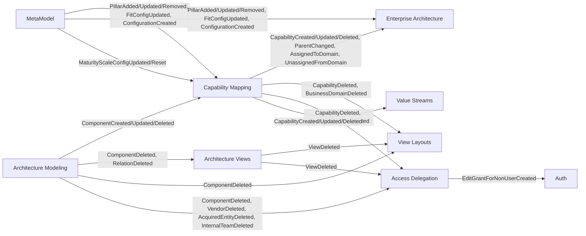

# EASI Architecture

Bounded Context Canvases for all contexts in the EASI platform. Each canvas follows the [DDD Crew Bounded Context Canvas](https://github.com/ddd-crew/bounded-context-canvas) template.

## Overview

EASI is built using Strategic Domain-Driven Design principles with clear bounded context boundaries. The system is organized into 10 bounded contexts across three classification tiers.

### 1. Architecture Modeling (Implemented)
**Purpose:** Manage IT application landscape -- what systems exist and how they interact.

**Location:** `/backend/internal/architecturemodeling/`

**Key Responsibilities:**
- Application component inventory (components, vendors, acquired entities, internal teams)
- Component relationships and dependencies
- System integration mapping

**Strategic Classification:** Supporting Domain

**Published Language:** `architecturemodeling/publishedlanguage` (`archPL`)

[Full Canvas](./ArchitectureModeling.md)

---

### 2. Architecture Views (Implemented)
**Purpose:** Create and manage visual representations of architecture for different stakeholder perspectives.

**Location:** `/backend/internal/architectureviews/`

**Key Responsibilities:**
- Multiple architecture views
- Custom layouts and styling
- Visual presentation management

**Strategic Classification:** Supporting Domain

**Published Language:** `architectureviews/publishedlanguage` (`avPL`)

[Full Canvas](./ArchitectureViews.md)

---

### 3. Capability Mapping (Implemented)
**Purpose:** Map business capabilities to IT systems, track maturity, dependencies, and strategic alignment.

**Location:** `/backend/internal/capabilitymapping/`

**Key Responsibilities:**
- Business capability taxonomy (L1-L4 hierarchy)
- Capability-to-system realization mapping
- Capability maturity and strategic alignment
- Business domain groupings (L1 capabilities)
- Capability dependencies
- Strategy importance and application fit scoring

**Strategic Classification:** Core Domain

**Published Language:** `capabilitymapping/publishedlanguage` (`cmPL`)

[Full Canvas](./CapabilityMapping.md)

---

### 4. MetaModel (Implemented)
**Purpose:** Manage configurable meta-model elements that control how the architecture modeling tool behaves within each tenant.

**Location:** `/backend/internal/metamodel/`

**Key Responsibilities:**
- Maturity scale configuration
- Strategy pillar definitions
- Pillar fit scoring configuration
- Tenant-specific modeling vocabulary

**Strategic Classification:** Supporting Domain

**Published Language:** `metamodel/publishedlanguage` (`mmPL`)

[Full Canvas](./MetaModel.md)

---

### 5. Enterprise Architecture (Implemented)
**Purpose:** Enable cross-domain capability analysis, standardization tracking, and maturity gap analysis for investment prioritization.

**Location:** `/backend/internal/enterprisearchitecture/`

**Key Responsibilities:**
- Enterprise capability groupings (cross-domain)
- Capability overlap discovery and link management
- Standardization candidate tracking
- Cross-domain maturity gap analysis
- Strategic importance at enterprise level
- Time-based investment suggestions

**Strategic Classification:** Core Domain

[Full Canvas](./EnterpriseArchitecture.md)

---

### 6. Value Streams (Implemented)
**Purpose:** Model value streams with stages and map business capabilities to each stage.

**Location:** `/backend/internal/valuestreams/`

**Key Responsibilities:**
- Value stream definitions
- Stage management and ordering
- Capability-to-stage mapping

**Strategic Classification:** Core Domain

**Published Language:** `valuestreams/publishedlanguage` (`vsPL`)

---

### 7. Access Delegation (Implemented)
**Purpose:** Manage temporary edit grants that allow specific users to modify specific artifacts.

**Location:** `/backend/internal/accessdelegation/`

**Key Responsibilities:**
- Edit grant lifecycle (activation, revocation, expiration)
- Artifact-scoped access delegation
- Auto-invitation for non-user grantees

**Strategic Classification:** Supporting Domain

**Published Language:** `accessdelegation/publishedlanguage` (`adPL`)

---

### 8. View Layouts (Implemented)
**Purpose:** Persist element positions, colors, and preferences for layout contexts (views, business domains, etc.).

**Location:** `/backend/internal/viewlayouts/`

**Key Responsibilities:**
- Layout container management
- Element positioning and styling
- Layout preferences per context

**Strategic Classification:** Supporting Domain

---

### 9. Releases (Implemented)
**Purpose:** Track and communicate EASI platform releases and version history.

**Location:** `/backend/internal/releases/`

**Key Responsibilities:**
- Version tracking
- Release notes
- Platform version reporting

**Strategic Classification:** Generic Subdomain

[Full Canvas](./Releases.md)

---

### 10. Enterprise Strategy (Future)
**Purpose:** Govern strategic architectural decisions about business domain evolution.

**Location:** `/backend/internal/enterprisestrategy/` (future)

**Key Responsibilities:**
- Domain consolidation (merging domains)
- Domain decomposition (splitting domains)
- Strategic area retirement
- Strategic decision audit trail
- Impact analysis for structural changes

**Strategic Classification:** Core Domain

[Full Canvas](./EnterpriseStrategy.md)

---

## Published Language Catalogue

Each publishing bounded context exposes a `publishedlanguage/events.go` package containing typed string constants. These constants form the **published language** -- the contract between upstream and downstream contexts. Consuming contexts import only these constants, never domain event structs.

For implementation details and conventions, see [/docs/backend/cross-context-events.md](/docs/backend/cross-context-events.md).

### Architecture Modeling (`archPL`)

**Package:** `backend/internal/architecturemodeling/publishedlanguage`

| Constant | Event Type String | Consumers |
|----------|-------------------|-----------|
| `ApplicationComponentCreated` | `"ApplicationComponentCreated"` | Capability Mapping (ComponentCacheProjector) |
| `ApplicationComponentUpdated` | `"ApplicationComponentUpdated"` | Capability Mapping (ComponentCacheProjector, RealizationProjector) |
| `ApplicationComponentDeleted` | `"ApplicationComponentDeleted"` | Capability Mapping (ComponentCacheProjector, RealizationProjector), Architecture Views, View Layouts, Access Delegation |
| `ComponentRelationDeleted` | `"ComponentRelationDeleted"` | Architecture Views |
| `AcquiredEntityDeleted` | `"AcquiredEntityDeleted"` | Access Delegation |
| `VendorDeleted` | `"VendorDeleted"` | Access Delegation |
| `InternalTeamDeleted` | `"InternalTeamDeleted"` | Access Delegation |

### MetaModel (`mmPL`)

**Package:** `backend/internal/metamodel/publishedlanguage`

| Constant | Event Type String | Consumers |
|----------|-------------------|-----------|
| `MetaModelConfigurationCreated` | `"MetaModelConfigurationCreated"` | Capability Mapping (StrategyPillarCacheProjector), Enterprise Architecture (StrategyPillarCacheProjector) |
| `StrategyPillarAdded` | `"StrategyPillarAdded"` | Capability Mapping (StrategyPillarCacheProjector), Enterprise Architecture (StrategyPillarCacheProjector) |
| `StrategyPillarUpdated` | `"StrategyPillarUpdated"` | Capability Mapping (StrategyPillarCacheProjector), Enterprise Architecture (StrategyPillarCacheProjector) |
| `StrategyPillarRemoved` | `"StrategyPillarRemoved"` | Capability Mapping (StrategyPillarCacheProjector), Enterprise Architecture (StrategyPillarCacheProjector) |
| `PillarFitConfigurationUpdated` | `"PillarFitConfigurationUpdated"` | Capability Mapping (StrategyPillarCacheProjector), Enterprise Architecture (StrategyPillarCacheProjector) |
| `MaturityScaleConfigUpdated` | `"MaturityScaleConfigUpdated"` | Capability Mapping (MaturityScaleConfigUpdatedHandler) |
| `MaturityScaleConfigReset` | `"MaturityScaleConfigReset"` | Capability Mapping (MaturityScaleConfigUpdatedHandler) |

### Capability Mapping (`cmPL`)

**Package:** `backend/internal/capabilitymapping/publishedlanguage`

| Constant | Event Type String | Consumers |
|----------|-------------------|-----------|
| `CapabilityCreated` | `"CapabilityCreated"` | Enterprise Architecture (DomainCapabilityMetadataProjector), Value Streams (CapabilityProjector) |
| `CapabilityUpdated` | `"CapabilityUpdated"` | Enterprise Architecture (DomainCapabilityMetadataProjector), Value Streams (CapabilityProjector, CapabilityNameSyncProjector) |
| `CapabilityDeleted` | `"CapabilityDeleted"` | Enterprise Architecture (DomainCapabilityMetadataProjector), View Layouts, Access Delegation, Value Streams (CapabilityProjector, CapabilityDeletedHandler) |
| `CapabilityParentChanged` | `"CapabilityParentChanged"` | Enterprise Architecture (DomainCapabilityMetadataProjector, EnterpriseCapabilityLinkProjector) |
| `CapabilityAssignedToDomain` | `"CapabilityAssignedToDomain"` | Enterprise Architecture (DomainCapabilityMetadataProjector) |
| `CapabilityUnassignedFromDomain` | `"CapabilityUnassignedFromDomain"` | Enterprise Architecture (DomainCapabilityMetadataProjector) |
| `BusinessDomainDeleted` | `"BusinessDomainDeleted"` | View Layouts, Access Delegation |

### Architecture Views (`avPL`)

**Package:** `backend/internal/architectureviews/publishedlanguage`

| Constant | Event Type String | Consumers |
|----------|-------------------|-----------|
| `ViewDeleted` | `"ViewDeleted"` | View Layouts, Access Delegation |

### Access Delegation (`adPL`)

**Package:** `backend/internal/accessdelegation/publishedlanguage`

| Constant | Event Type String | Consumers |
|----------|-------------------|-----------|
| `EditGrantActivated` | `"EditGrantActivated"` | (intra-context projector) |
| `EditGrantRevoked` | `"EditGrantRevoked"` | (intra-context projector) |
| `EditGrantExpired` | `"EditGrantExpired"` | (intra-context projector) |
| `EditGrantForNonUserCreated` | `"EditGrantForNonUserCreated"` | Auth (InvitationAutoCreateProjector) |

### Value Streams (`vsPL`)

**Package:** `backend/internal/valuestreams/publishedlanguage`

| Constant | Event Type String | Consumers |
|----------|-------------------|-----------|
| `ValueStreamCreated` | `"ValueStreamCreated"` | (intra-context projector) |
| `ValueStreamUpdated` | `"ValueStreamUpdated"` | (intra-context projector) |
| `ValueStreamDeleted` | `"ValueStreamDeleted"` | (intra-context projector) |
| `ValueStreamStageAdded` | `"ValueStreamStageAdded"` | (intra-context projector) |
| `ValueStreamStageUpdated` | `"ValueStreamStageUpdated"` | (intra-context projector) |
| `ValueStreamStageRemoved` | `"ValueStreamStageRemoved"` | (intra-context projector) |
| `ValueStreamStagesReordered` | `"ValueStreamStagesReordered"` | (intra-context projector) |
| `ValueStreamStageCapabilityAdded` | `"ValueStreamStageCapabilityAdded"` | (intra-context projector) |
| `ValueStreamStageCapabilityRemoved` | `"ValueStreamStageCapabilityRemoved"` | (intra-context projector) |

---

## Context Map

### Diagram

```
                              ┌─────────────────────────────────────────────────────────────────┐
                              |                    Architecture Modeling                         |
                              |                  (Application Component SoR)                     |
                              |                  [Supporting Domain]                             |
                              └─────────┬──────────────────┬──────────────────┬─────────────────┘
                                        | Events           | Events           | Events
                                        | (Component CRUD, | (Component       | (Component/Vendor/
                                        |  Relation Del)   |  CRUD)           |  AcquiredEntity/
                                        |                  |                  |  InternalTeam Del)
                                        v                  v                  v
┌──────────────────────┐    ┌─────────────────────┐    ┌───────────────────────────┐
| Value Streams        |    | Architecture Views  |    | Access Delegation         |
| (Stage-Cap Mapping)  |    | (Views/Layouts)     |    | (Edit Grants)             |
| [Core Domain]        |    | [Supporting Domain] |    | [Supporting Domain]       |
└──────────────────────┘    └─────────┬───────────┘    └───────────────┬───────────┘
        ^                             | Events (ViewDeleted)           | Events
        | Events                      v                                | (EditGrantForNonUserCreated)
        | (Capability lifecycle)┌──────────────────┐                   v
        |                     | View Layouts     |           ┌────────────────┐
┌───────────────────────┐     | (Position/Style) |           | Auth           |
| Capability Mapping    |◄────| [Supporting]     |           | (Users/Invites)|
| (Cap-to-System Map)  |     └──────────────────┘           | [Supporting]   |
| [Core Domain]         |                                    └────────────────┘
└───────┬───────────────┘
        |                  ┌────────────────────────────┐
        | Events           | MetaModel                  |
        | (Capability      | (Configuration)            |
        |  lifecycle,      | [Supporting Domain]        |
        |  Domain assign)  └──────┬──────────┬──────────┘
        v                         | Events   | Events
┌────────────────────────┐        | (Pillar  | (Pillar/Maturity
| Enterprise Architecture|◄───────┘  config) |  config)
| (Cross-domain Analysis)|                   |
| [Core Domain]          |                   v
└────────────────────────┘        ┌──────────────────────┐
                                  | (Back to Capability  |
                                  |  Mapping, above)     |
                                  └──────────────────────┘

                  ┌─────────────────┐
                  | Releases        |
                  | (Version Info)  |
                  | [Generic Domain]|
                  └─────────────────┘
                  (Isolated -- no integration)
```

### Event Flows (Mermaid)



### Relationship Types

| Upstream | Downstream | Relationship | Integration Pattern |
|----------|-----------|--------------|---------------------|
| Architecture Modeling | Architecture Views | Customer-Supplier | Event-driven (component/relation deletions) |
| Architecture Modeling | Capability Mapping | Customer-Supplier | Event-driven (component CRUD) + Query (component read model) |
| Architecture Modeling | View Layouts | Customer-Supplier | Event-driven (component deletion cleanup) |
| Architecture Modeling | Access Delegation | Customer-Supplier | Event-driven (artifact deletion revokes grants) |
| MetaModel | Capability Mapping | Published Language | Event-driven (pillar/maturity config) + Query (configuration gateway) |
| MetaModel | Enterprise Architecture | Published Language | Event-driven (pillar config) + Query (pillar cache) |
| Capability Mapping | Enterprise Architecture | Customer-Supplier | Event-driven (capability lifecycle, domain assignments) |
| Capability Mapping | View Layouts | Customer-Supplier | Event-driven (capability/domain deletion cleanup) |
| Capability Mapping | Access Delegation | Customer-Supplier | Event-driven (artifact deletion revokes grants) |
| Capability Mapping | Value Streams | Customer-Supplier | Event-driven (capability lifecycle via local cache projector) |
| Architecture Views | View Layouts | Customer-Supplier | Event-driven (view deletion cleanup) |
| Architecture Views | Access Delegation | Customer-Supplier | Event-driven (artifact deletion revokes grants) |
| Access Delegation | Auth | Customer-Supplier | Event-driven (auto-invite non-users) |
| Enterprise Architecture | Enterprise Strategy | Customer-Supplier | Query (analysis data) -- future |
| Capability Mapping | Enterprise Strategy | Partnership | Command-driven (strategic ops) -- future |

---

## Cross-Domain Event Subscriptions Registry

This section documents every event subscription that crosses a bounded context boundary, tracing from publishing context through to the consuming projector or handler. This is the authoritative reference for understanding cross-context event flow.

### Architecture Modeling publishes to:

**Architecture Views** (via `archPL`):
| Event | Handler | Purpose |
|-------|---------|---------|
| `ApplicationComponentDeleted` | `ApplicationComponentDeletedHandler` | Remove deleted components from all views |
| `ComponentRelationDeleted` | `ComponentRelationDeletedHandler` | Clean up relation visualizations |

**Capability Mapping** (via `archPL`):
| Event | Projector | Purpose |
|-------|-----------|---------|
| `ApplicationComponentCreated` | `ComponentCacheProjector` | Cache component name for realization display |
| `ApplicationComponentUpdated` | `ComponentCacheProjector`, `RealizationProjector` | Update cached name, update realization display |
| `ApplicationComponentDeleted` | `ComponentCacheProjector`, `RealizationProjector` | Remove cache entry, remove all realizations for component |

**View Layouts** (via `archPL`):
| Event | Handler | Purpose |
|-------|---------|---------|
| `ApplicationComponentDeleted` | `ComponentDeletedHandler` | Remove element positions for deleted components |

**Access Delegation** (via `archPL`):
| Event | Projector | Purpose |
|-------|-----------|---------|
| `ApplicationComponentDeleted` | `ArtifactDeletionProjector` (component) | Revoke edit grants for deleted components |
| `AcquiredEntityDeleted` | `ArtifactDeletionProjector` (acquired_entity) | Revoke edit grants for deleted acquired entities |
| `VendorDeleted` | `ArtifactDeletionProjector` (vendor) | Revoke edit grants for deleted vendors |
| `InternalTeamDeleted` | `ArtifactDeletionProjector` (internal_team) | Revoke edit grants for deleted internal teams |

### MetaModel publishes to:

**Capability Mapping** (via `mmPL`):
| Event | Projector/Handler | Purpose |
|-------|-------------------|---------|
| `MetaModelConfigurationCreated` | `StrategyPillarCacheProjector` | Seed local pillar cache on initial configuration |
| `StrategyPillarAdded` | `StrategyPillarCacheProjector` | Add new pillar to local cache |
| `StrategyPillarUpdated` | `StrategyPillarCacheProjector` | Update pillar name/description in cache |
| `StrategyPillarRemoved` | `StrategyPillarCacheProjector` | Remove pillar from local cache |
| `PillarFitConfigurationUpdated` | `StrategyPillarCacheProjector` | Update fit scoring configuration in cache |
| `MaturityScaleConfigUpdated` | `MaturityScaleConfigUpdatedHandler` | Invalidate maturity scale gateway cache |
| `MaturityScaleConfigReset` | `MaturityScaleConfigUpdatedHandler` | Reset maturity scale gateway cache to defaults |

**Enterprise Architecture** (via `mmPL`):
| Event | Projector | Purpose |
|-------|-----------|---------|
| `MetaModelConfigurationCreated` | `StrategyPillarCacheProjector` | Seed local pillar cache on initial configuration |
| `StrategyPillarAdded` | `StrategyPillarCacheProjector` | Add new pillar to local cache |
| `StrategyPillarUpdated` | `StrategyPillarCacheProjector` | Update pillar name/description in cache |
| `StrategyPillarRemoved` | `StrategyPillarCacheProjector` | Remove pillar from local cache |
| `PillarFitConfigurationUpdated` | `StrategyPillarCacheProjector` | Update fit scoring configuration in cache |

### Capability Mapping publishes to:

**Enterprise Architecture** (via `cmPL`):
| Event | Projector | Purpose |
|-------|-----------|---------|
| `CapabilityCreated` | `DomainCapabilityMetadataProjector` | Track new capability metadata (name, level, parent, L1 root, business domain) |
| `CapabilityUpdated` | `DomainCapabilityMetadataProjector` | Update capability name in metadata cache |
| `CapabilityDeleted` | `DomainCapabilityMetadataProjector` | Remove metadata, clean up enterprise capability links |
| `CapabilityParentChanged` | `DomainCapabilityMetadataProjector`, `EnterpriseCapabilityLinkProjector` | Recalculate L1 ancestry, recompute blocking relationships |
| `CapabilityAssignedToDomain` | `DomainCapabilityMetadataProjector` | Update business domain for capability subtree, recalculate domain counts |
| `CapabilityUnassignedFromDomain` | `DomainCapabilityMetadataProjector` | Clear business domain for capability subtree, recalculate domain counts |

**View Layouts** (via `cmPL`):
| Event | Handler | Purpose |
|-------|---------|---------|
| `CapabilityDeleted` | `CapabilityDeletedHandler` | Remove element positions for deleted capabilities |
| `BusinessDomainDeleted` | `BusinessDomainDeletedHandler` | Remove layout containers for deleted domains |

**Access Delegation** (via `cmPL`):
| Event | Projector | Purpose |
|-------|-----------|---------|
| `CapabilityDeleted` | `ArtifactDeletionProjector` (capability) | Revoke edit grants for deleted capabilities |
| `BusinessDomainDeleted` | `ArtifactDeletionProjector` (domain) | Revoke edit grants for deleted domains |

**Value Streams** (via `cmPL`):
| Event | Projector/Handler | Purpose |
|-------|-------------------|---------|
| `CapabilityCreated` | `CapabilityProjector` | Cache capability name for existence check |
| `CapabilityUpdated` | `CapabilityProjector`, `CapabilityNameSyncProjector` | Update cached name, update denormalized stage-capability names |
| `CapabilityDeleted` | `CapabilityProjector`, `CapabilityDeletedHandler` | Remove cache entry, remove orphan capability references from stages |

### Architecture Views publishes to:

**View Layouts** (via `avPL`):
| Event | Handler | Purpose |
|-------|---------|---------|
| `ViewDeleted` | `ViewDeletedHandler` | Remove layout containers for deleted views |

**Access Delegation** (via `avPL`):
| Event | Projector | Purpose |
|-------|-----------|---------|
| `ViewDeleted` | `ArtifactDeletionProjector` (view) | Revoke edit grants for deleted views |

### Access Delegation publishes to:

**Auth** (via `adPL`):
| Event | Projector | Purpose |
|-------|-----------|---------|
| `EditGrantForNonUserCreated` | `InvitationAutoCreateProjector` | Auto-create invitation for grantee who is not yet a platform user |

---

## Anti-Corruption Layer Pattern

All cross-context event consumption follows the ACL pattern:

1. **Import only constants** from the publishing context's `publishedlanguage` package
2. **Define local deserialization structs** in the consuming context with only the fields needed
3. **Never import domain event structs** from another context

Example from Capability Mapping consuming Architecture Modeling events:

```go
import archPL "easi/backend/internal/architecturemodeling/publishedlanguage"

type applicationComponentDeletedEvent struct {
    ID string `json:"id"`
}

func (p *RealizationProjector) ProjectEvent(ctx context.Context, eventType string, eventData []byte) error {
    switch eventType {
    case archPL.ApplicationComponentDeleted:
        var event applicationComponentDeletedEvent
        json.Unmarshal(eventData, &event)
        return p.readModel.DeleteByComponentID(ctx, event.ID)
    }
    return nil
}
```

This ensures each context remains decoupled. The consumer cherry-picks only the fields it needs and is resilient to upstream schema additions.

---

## Domain Classification

### Core Domains (Competitive Advantage)
1. **Capability Mapping** -- Sophisticated capability-to-system mapping with strategic analysis
2. **Enterprise Architecture** -- Cross-domain capability analysis and standardization tracking
3. **Value Streams** -- Value stream modeling with capability mapping to stages
4. **Enterprise Strategy** (future) -- Strategic governance of domain evolution

### Supporting Domains (Essential but not differentiating)
1. **Architecture Modeling** -- Standard application inventory
2. **Architecture Views** -- View management and visualization
3. **MetaModel** -- Tenant-specific configuration and vocabulary
4. **View Layouts** -- Element positioning and styling persistence
5. **Access Delegation** -- Temporary edit grant management

### Generic Domains (Commodity)
1. **Releases** -- Simple version tracking

---

## Context Autonomy

Each bounded context has:
- **Own Event Store**: Separate event streams in PostgreSQL
- **Own Read Models**: Denormalized projections for query performance
- **Own Aggregates**: Independent transactional boundaries
- **Own API**: REST Level 3 with context-specific endpoints
- **Tenant Isolation**: Multi-tenancy at context level (except Releases)

**No Shared Databases**: Contexts communicate via events and queries, never direct database access.

**No Circular Dependencies**: Dependency graph is acyclic.

**Local Caches over Shared State**: When a downstream context needs reference data (e.g., pillar names, component names), it maintains a local cache projector populated by upstream events, rather than querying the upstream context at read time. Examples:
- `ComponentCacheProjector` in Capability Mapping caches component names from Architecture Modeling
- `StrategyPillarCacheProjector` in both Capability Mapping and Enterprise Architecture caches pillar data from MetaModel
- `DomainCapabilityMetadataProjector` in Enterprise Architecture caches capability metadata from Capability Mapping
- `CapabilityProjector` in Value Streams caches capability names from Capability Mapping

---

## Implementation Status

| Context | Status | Location | CQRS/ES | Published Language |
|---------|--------|----------|---------|--------------------|
| Architecture Modeling | Implemented | `/backend/internal/architecturemodeling/` | Yes | 7 events |
| Architecture Views | Implemented | `/backend/internal/architectureviews/` | Yes | 1 event |
| Capability Mapping | Implemented | `/backend/internal/capabilitymapping/` | Yes | 7 events |
| MetaModel | Implemented | `/backend/internal/metamodel/` | Yes | 7 events |
| Enterprise Architecture | Implemented | `/backend/internal/enterprisearchitecture/` | Yes | -- |
| Value Streams | Implemented | `/backend/internal/valuestreams/` | Yes | 9 events |
| Access Delegation | Implemented | `/backend/internal/accessdelegation/` | Yes | 4 events |
| View Layouts | Implemented | `/backend/internal/viewlayouts/` | No (CRUD) | -- |
| Releases | Implemented | `/backend/internal/releases/` | No (CRUD) | -- |
| Enterprise Strategy | Future | `/backend/internal/enterprisestrategy/` (future) | Yes (future) | -- |
