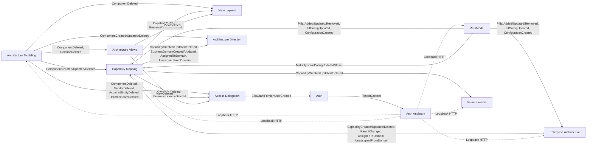

# EASI Architecture

Bounded Context Canvases for all contexts in the EASI platform. Each canvas follows the [DDD Crew Bounded Context Canvas](https://github.com/ddd-crew/bounded-context-canvas) template.

## Bounded Contexts

All locations are relative to `/backend/internal/`.

| Context | Classification | Purpose | Location | Canvas |
|---------|----------------|---------|----------|--------|
| Architecture Modeling | Supporting | Manage IT application landscape — what systems exist and how they interact | `architecturemodeling/` | [Canvas](./ArchitectureModeling.md) |
| Architecture Views | Supporting | Create and manage visual representations of architecture for stakeholder perspectives | `architectureviews/` | [Canvas](./ArchitectureViews.md) |
| Capability Mapping | Core | Map business capabilities to IT systems, track maturity, dependencies, and strategic alignment | `capabilitymapping/` | [Canvas](./CapabilityMapping.md) |
| MetaModel | Supporting | Manage configurable meta-model elements that control modeling tool behavior per tenant | `metamodel/` | [Canvas](./MetaModel.md) |
| Enterprise Architecture | Core | Enable cross-domain capability analysis, standardization tracking, and maturity gap analysis | `enterprisearchitecture/` | [Canvas](./EnterpriseArchitecture.md) |
| Value Streams | Core | Model value streams with stages and map business capabilities to each stage | `valuestreams/` | — |
| Access Delegation | Supporting | Manage temporary edit grants for specific users on specific artifacts | `accessdelegation/` | — |
| View Layouts | Supporting | Persist element positions, colors, and preferences for layout contexts | `viewlayouts/` | — |
| Releases | Generic | Track and communicate platform releases and version history | `releases/` | [Canvas](./Releases.md) |
| Arch Assistant | Supporting | AI-powered conversational assistant for exploring and modifying enterprise architecture | `archassistant/` | [Canvas](./ArchAssistant.md) |
| Architecture Direction | Core | Govern architectural direction decisions — standardization, migration horizons, technology placement | `architecturedirection/` | — |

---

## Context Map

```
                              ┌─────────────────────────────────────────────────────────────────┐
                              |                    Architecture Modeling                         |
                              |                  (Application Component SoR)                     |
                              |                  [Supporting Domain]                             |
                              └─────────┬──────────────────┬──────────────────┬─────────────────┘
                                        | Events           | Events           | Events
                                        | (Component CRUD, | (Component       | (Component/Vendor/
                                        |  Relation Del)   |  CRUD)           |  AcquiredEntity/
                                        |                  |                  |  InternalTeam Del)
                                        v                  v                  v
┌──────────────────────┐    ┌─────────────────────┐    ┌───────────────────────────┐
| Value Streams        |    | Architecture Views  |    | Access Delegation         |
| (Stage-Cap Mapping)  |    | (Views/Layouts)     |    | (Edit Grants)             |
| [Core Domain]        |    | [Supporting Domain] |    | [Supporting Domain]       |
└──────────────────────┘    └─────────┬───────────┘    └───────────────┬───────────┘
        ^                             | Events (ViewDeleted)           | Events
        | Events                      v                                | (EditGrantForNonUserCreated)
        | (Capability lifecycle)┌──────────────────┐                   v
        |                     | View Layouts     |           ┌────────────────┐
┌───────────────────────┐     | (Position/Style) |           | Auth           |
| Capability Mapping    |◄────| [Supporting]     |           | (Users/Invites)|
| (Cap-to-System Map)  |     └──────────────────┘           | [Supporting]   |
| [Core Domain]         |                                    └────────────────┘
└───────┬───────────────┘
        |                  ┌────────────────────────────┐
        | Events           | MetaModel                  |
        | (Capability      | (Configuration)            |
        |  lifecycle,      | [Supporting Domain]        |
        |  Domain assign)  └──────┬──────────┬──────────┘
        v                         | Events   | Events
┌────────────────────────┐        | (Pillar  | (Pillar/Maturity
| Enterprise Architecture|◄───────┘  config) |  config)
| (Cross-domain Analysis)|                   |
| [Core Domain]          |                   v
└────────────────────────┘        ┌──────────────────────┐
                                  | (Back to Capability  |
                                  |  Mapping, above)     |
                                  └──────────────────────┘

                  ┌─────────────────┐
                  | Releases        |
                  | (Version Info)  |
                  | [Generic Domain]|
                  └─────────────────┘
                  (Isolated -- no integration)

┌──────────────────────────────────────────────────────────┐
| Arch Assistant                                           |
| (AI Conversational Agent)                                |
| [Supporting Domain]                                      |
|                                                          |
| Consumes TenantCreated from Auth                         |
| Calls all other BCs via loopback HTTP (tool execution)   |
| Defines AgentToolSpec contract consumed by other BCs     |
└──────────────────────────────────────────────────────────┘
  ↑ TenantCreated          ↕ Loopback HTTP (tools)
  from Auth                to Arch Modeling, Cap Mapping,
                           Enterprise Arch, Value Streams,
                           MetaModel
```

### Event Flows (Mermaid)


```mermaid
flowchart LR
    AM[Architecture Modeling]
    AV[Architecture Views]
    CM[Capability Mapping]
    MM[MetaModel]
    EA[Enterprise Architecture]
    VL[View Layouts]
    AD[Access Delegation]
    AU[Auth]
    VS[Value Streams]
    ADR[Architecture Direction]

    AM -->|ComponentCreated/Updated/Deleted| CM
    AM -->|ComponentCreated/Updated/Deleted| ADR
    AM -->|ComponentDeleted, RelationDeleted| AV
    AM -->|ComponentDeleted| VL
    AM -->|ComponentDeleted, VendorDeleted, AcquiredEntityDeleted, InternalTeamDeleted| AD

    MM -->|PillarAdded/Updated/Removed, FitConfigUpdated, ConfigurationCreated| CM
    MM -->|PillarAdded/Updated/Removed, FitConfigUpdated, ConfigurationCreated| EA
    MM -->|MaturityScaleConfigUpdated/Reset| CM

    CM -->|CapabilityCreated/Updated/Deleted, ParentChanged, AssignedToDomain, UnassignedFromDomain| EA
    CM -->|CapabilityDeleted, BusinessDomainDeleted| VL
    CM -->|CapabilityDeleted, BusinessDomainDeleted| AD

    AV -->|ViewDeleted| VL
    AV -->|ViewDeleted| AD

    AD -->|EditGrantForNonUserCreated| AU

    CM -->|CapabilityCreated/Updated/Deleted| VS
    CM -->|CapabilityCreated/Updated/Deleted, BusinessDomainCreated/Updated, AssignedToDomain, UnassignedFromDomain| ADR

    AU -->|TenantCreated| AA
    AA[Arch Assistant] -.->|Loopback HTTP| AM
    AA -.->|Loopback HTTP| CM
    AA -.->|Loopback HTTP| EA
    AA -.->|Loopback HTTP| VS
    AA -.->|Loopback HTTP| MM
```

### Relationship Types

| Upstream | Downstream | Relationship | Integration Pattern |
|----------|-----------|--------------|---------------------|
| Architecture Modeling | Architecture Views | Customer-Supplier | Event-driven (component/relation deletions) |
| Architecture Modeling | Capability Mapping | Customer-Supplier | Event-driven (component CRUD) + Query (component read model) |
| Architecture Modeling | View Layouts | Customer-Supplier | Event-driven (component deletion cleanup) |
| Architecture Modeling | Access Delegation | Customer-Supplier | Event-driven (artifact deletion revokes grants) |
| Architecture Modeling | Architecture Direction | Customer-Supplier | Event-driven (component CRUD for stale detection) |
| MetaModel | Capability Mapping | Published Language | Event-driven (pillar/maturity config) + Query (configuration gateway) |
| MetaModel | Enterprise Architecture | Published Language | Event-driven (pillar config) + Query (pillar cache) |
| Capability Mapping | Enterprise Architecture | Customer-Supplier | Event-driven (capability lifecycle, domain assignments) |
| Capability Mapping | View Layouts | Customer-Supplier | Event-driven (capability/domain deletion cleanup) |
| Capability Mapping | Access Delegation | Customer-Supplier | Event-driven (artifact deletion revokes grants) |
| Capability Mapping | Value Streams | Customer-Supplier | Event-driven (capability lifecycle via local cache projector) |
| Capability Mapping | Architecture Direction | Customer-Supplier | Event-driven (capability/domain lifecycle for stale detection) |
| Architecture Views | View Layouts | Customer-Supplier | Event-driven (view deletion cleanup) |
| Architecture Views | Access Delegation | Customer-Supplier | Event-driven (artifact deletion revokes grants) |
| Access Delegation | Auth | Customer-Supplier | Event-driven (auto-invite non-users) |
| Auth | Arch Assistant | Customer-Supplier | Event-driven (TenantCreated provisions AI configuration) |
| Arch Assistant | Architecture Modeling | Open Host Service | Loopback HTTP (agent tool execution) |
| Arch Assistant | Capability Mapping | Open Host Service | Loopback HTTP (agent tool execution) |
| Arch Assistant | Enterprise Architecture | Open Host Service | Loopback HTTP (agent tool execution) |
| Arch Assistant | Value Streams | Open Host Service | Loopback HTTP (agent tool execution) |
| Arch Assistant | MetaModel | Open Host Service | Loopback HTTP (agent tool execution) |

---

## Cross-Context Integration

Each publishing bounded context exposes a `publishedlanguage/events.go` package containing typed string constants — the contract between upstream and downstream contexts. Consuming contexts import only these constants, never domain event structs (ACL pattern).

For published language catalogues, event subscription details, and implementation conventions, see [/docs/backend/cross-context-events.md](/docs/backend/cross-context-events.md) and the individual canvas files above.

---

## Context Autonomy

Each bounded context has:
- **Own Event Store**: Separate event streams in PostgreSQL
- **Own Read Models**: Denormalized projections for query performance
- **Own Aggregates**: Independent transactional boundaries
- **Own API**: REST Level 3 with context-specific endpoints
- **Tenant Isolation**: Multi-tenancy at context level (except Releases)

**No Shared Databases**: Contexts communicate via events and queries, never direct database access.

**No Circular Dependencies**: Dependency graph is acyclic.

**Local Caches over Shared State**: When a downstream context needs reference data (e.g., pillar names, component names), it maintains a local cache projector populated by upstream events, rather than querying the upstream context at read time.
