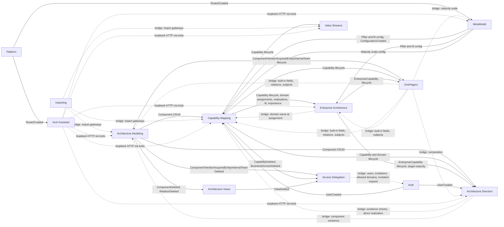

# EASI Architecture

Bounded Context Canvases for all contexts in the EASI platform. Each canvas follows the [DDD Crew Bounded Context Canvas](https://github.com/ddd-crew/bounded-context-canvas) template.

## Bounded Contexts

All locations are relative to `/backend/internal/`.

| Context | Classification | Purpose | Location | Canvas |
|---------|----------------|---------|----------|--------|
| Architecture Modeling | Supporting | Manage IT application landscape — what systems exist and how they interact | `architecturemodeling/` | [Canvas](./ArchitectureModeling.md) |
| Architecture Views | Supporting | Create and manage visual representations of architecture for stakeholder perspectives | `architectureviews/` | [Canvas](./ArchitectureViews.md) |
| Capability Mapping | Core | Map business capabilities to IT systems, track maturity, dependencies, and strategic alignment | `capabilitymapping/` | [Canvas](./CapabilityMapping.md) |
| MetaModel | Supporting | Manage configurable meta-model elements that control modeling tool behavior per tenant | `metamodel/` | [Canvas](./MetaModel.md) |
| Enterprise Architecture | Core | Own enterprise capability identity, strategic importance, target maturity and TIME suggestions | `enterprisearchitecture/` | [Canvas](./EnterpriseArchitecture.md) |
| Architecture Direction | Core | Govern directions, standard applications, TIME assessments and journeys; own composition and maturity analysis derived from direction sources | `architecturedirection/` | [Canvas](./ArchitectureDirection.md) |
| Value Streams | Core | Model value streams with stages and map business capabilities to each stage | `valuestreams/` | — |
| Access Delegation | Supporting | Manage temporary edit grants for specific users on specific artifacts | `accessdelegation/` | — |
| Releases | Generic | Track and communicate platform releases and version history | `releases/` | [Canvas](./Releases.md) |
| Arch Assistant | Supporting | AI-powered conversational assistant for exploring and modifying enterprise architecture | `archassistant/` | [Canvas](./ArchAssistant.md) |
| OnePagers | Supporting | Configure per-subject-type one-pager fact sheets, record facts, render one-pagers, report completeness | `onepagers/` | [Canvas](./OnePagers.md) |

Not bounded contexts: `auth/` (identity, roles, invitations, sessions) and `platform/` (tenant provisioning) are supporting packages every context may depend on; `shared/` is the shared kernel (including `shared/agenttools`, the tool contract every context implements for Arch Assistant); `infrastructure/` holds database, event store and the composition root.

---

## Context Map

```mermaid
flowchart LR
    AM[Architecture Modeling]
    AV[Architecture Views]
    CM[Capability Mapping]
    MM[MetaModel]
    EA[Enterprise Architecture]
    ADR[Architecture Direction]
    ACD[Access Delegation]
    AU[Auth]
    PL[Platform]
    VS[Value Streams]
    OP[OnePagers]
    IM[Importing]
    AA[Arch Assistant]

    AM -->|Component CRUD| CM
    AM -->|Component CRUD| ADR
    AM -->|ComponentDeleted, RelationDeleted| AV
    AM -->|Component/Vendor/AcquiredEntity/InternalTeam Deleted| ACD
    AM -->|Component/Vendor/AcquiredEntity/InternalTeam lifecycle| OP

    MM -->|Pillar and fit config, ConfigurationCreated| CM
    MM -->|Pillar and fit config| EA
    MM -->|Maturity scale config| CM

    CM -->|Capability lifecycle, domain assignments, realizations, fit, importance| EA
    CM -->|Capability and domain lifecycle| ADR
    CM -->|CapabilityDeleted, BusinessDomainDeleted| ACD
    CM -->|Capability lifecycle| VS
    CM -->|Capability lifecycle| OP

    EA -->|EnterpriseCapability lifecycle, target maturity| ADR
    EA -->|EnterpriseCapability lifecycle| OP

    AV -->|ViewDeleted| ACD
    AU -->|UserCreated| CM
    AU -->|UserCreated| ADR
    PL -->|TenantCreated| MM
    PL -->|TenantCreated| AA

    ACD -.->|bridge: users, invitations, allowed domains, invitation request| AU
    ADR -.->|bridge: existence checks, direct realization| CM
    ADR -.->|bridge: component existence| AM
    EA -.->|bridge: domain name at assignment| CM
    OP -.->|bridge: built-in fields, relations, subjects| AM
    OP -.->|bridge: built-in fields, relations, subjects| CM
    OP -.->|bridge: built-in fields, subjects| EA
    OP -.->|bridge: composition| ADR
    OP -.->|bridge: maturity scale| MM
    IM -.->|bridge: import gateways| AM
    IM -.->|bridge: import gateways| CM
    IM -.->|bridge: import gateways| VS
    AA -.->|loopback HTTP via tools| AM
    AA -.->|loopback HTTP via tools| CM
    AA -.->|loopback HTTP via tools| EA
    AA -.->|loopback HTTP via tools| ADR
    AA -.->|loopback HTTP via tools| VS
    AA -.->|loopback HTTP via tools| MM
```

Solid arrows are published-language events (upstream → downstream). Dotted arrows are declared composition-root bridges (consumer → supplier) — synchronous reads or calls wired in `backend/internal/infrastructure/api/*_bridges.go` and adapter files, each declared in `backend/internal/architecture_bridges_test.go`. Arch Assistant reaches other contexts only through the public HTTP API.

### Relationship Types

| Upstream | Downstream | Relationship | Integration Pattern |
|----------|-----------|--------------|---------------------|
| Architecture Modeling | Architecture Views | Customer-Supplier | Event-driven (component/relation deletions) |
| Architecture Modeling | Capability Mapping | Customer-Supplier | Event-driven (component CRUD into local cache) |
| Architecture Modeling | Access Delegation | Customer-Supplier | Event-driven (artifact deletion revokes grants) + declared bridge (artifact names) |
| Architecture Modeling | Architecture Direction | Customer-Supplier | Event-driven (component CRUD for stale detection) + declared bridge (component existence) |
| Architecture Modeling | OnePagers | Customer-Supplier | Event-driven (subject index) + declared bridge (built-in fields, relations, subject existence) |
| MetaModel | Capability Mapping | Published Language | Event-driven (pillar/maturity config) + local gateway |
| MetaModel | Enterprise Architecture | Published Language | Event-driven (pillar config into local cache) |
| MetaModel | OnePagers | Published Language | Declared bridge (maturity scale sections) |
| Capability Mapping | Enterprise Architecture | Customer-Supplier | Event-driven (capability lifecycle, realizations, fit, importance into local caches) + declared bridge (domain name at assignment) |
| Capability Mapping | Architecture Direction | Customer-Supplier | Event-driven (capability/domain lifecycle into node and name caches) + declared bridge (existence, direct realization, effective domain) |
| Capability Mapping | Access Delegation | Customer-Supplier | Event-driven (artifact deletion revokes grants) + declared bridge (artifact names) |
| Capability Mapping | Value Streams | Customer-Supplier | Event-driven (capability lifecycle via local cache projector) |
| Capability Mapping | OnePagers | Customer-Supplier | Event-driven (subject index) + declared bridge |
| Enterprise Architecture | Architecture Direction | Customer-Supplier | Event-driven (enterprise capability lifecycle and target maturity into local cache; deletion rejects the direction) |
| Enterprise Architecture | OnePagers | Customer-Supplier | Event-driven (subject index) + declared bridge |
| Architecture Direction | OnePagers | Customer-Supplier | Declared bridge (enterprise capability composition for the relation field) |
| Architecture Views | Access Delegation | Customer-Supplier | Event-driven (view deletion revokes grants) + declared bridge (view names) |
| Auth | Access Delegation | Customer-Supplier | Declared bridge (user existence, pending invitations, allowed domains, invitation request for non-users) |
| Auth | Architecture Views | Customer-Supplier | Declared bridge (user role check for view visibility) |
| Auth | Capability Mapping, Architecture Direction | Customer-Supplier | Event-driven (`UserCreated` into name caches) |
| Platform | MetaModel, Arch Assistant | Customer-Supplier | Event-driven (`TenantCreated` provisions defaults) |
| Architecture Modeling, Capability Mapping, Value Streams | Importing | Open Host Service | Declared bridge (import gateways) |
| Any context with a public API | Arch Assistant | Open Host Service | Loopback HTTP (agent tool execution); tools are declared in each context's published language against the `shared/agenttools` contract |

---

## Cross-Context Integration

Each publishing bounded context exposes a `publishedlanguage/events.go` package containing typed string constants — the contract between upstream and downstream contexts. Consuming contexts import only these constants, never domain event structs (ACL pattern).

For published language catalogues, event subscription details, the composition-root bridge registry and implementation conventions, see [/docs/backend/cross-context-events.md](/docs/backend/cross-context-events.md) and the individual canvas files above.

---

## Context Autonomy

Each bounded context has:
- **Own Event Store**: Separate event streams in PostgreSQL
- **Own Read Models**: Denormalized projections for query performance
- **Own Aggregates**: Independent transactional boundaries
- **Own API**: REST Level 3 with context-specific endpoints
- **Tenant Isolation**: Multi-tenancy at context level (except Releases)

**No Shared Databases**: Contexts communicate via events and declared bridges, never direct database access. `TestSQLSchemaOwnership` enforces that each context queries only its own schema.

**No Circular Dependencies — enforced.** The dependency graph has two kinds of edges: a context importing another context's `publishedlanguage`, and a declared composition-root bridge (consumer → supplier). `TestContextDependencyGraphIsAcyclic` in `backend/internal/architecture_bridges_test.go` rejects any cycle; `TestEveryCompositionRootBridgeIsDeclaredExactly`, `TestRouterOnlyRegistersRoutes`, `TestNoStaleBridgeDeclarations`, `TestNonContextPackagesImportOnlyPublishedLanguage` and `TestProductionCodeDoesNotImportTestSupport` reject any composition-root file that reaches two contexts without a declaration, a declaration that does not match the file's imports, a `router.go` that imports anything but a context's `infrastructure/api`, and any `shared/` or `infrastructure/` package importing a context's internals. There is no allowlist for cycles.

**Local Caches over Shared State — preferred.** When a downstream context needs reference data over time (names, hierarchy, maturity), it maintains a local cache projector populated by upstream events and backfilled by migration, rather than querying the upstream context at read time. Query-time reads at write-time validation or display enrichment are acceptable when declared as bridges; the registry makes every remaining one visible.

**Event subscriptions are wired inside the consuming context**, never in the composition root.
