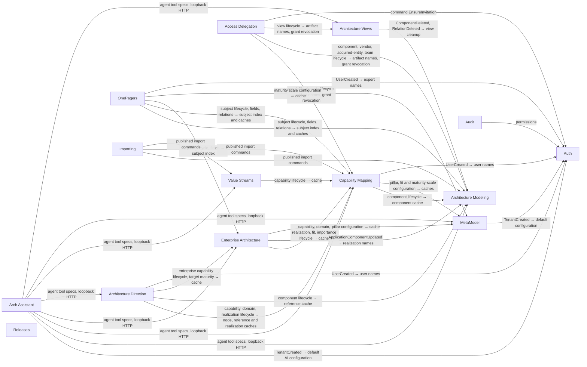

# EASI Architecture

Bounded Context Canvases for all contexts in the EASI platform. Each canvas follows the [DDD Crew Bounded Context Canvas](https://github.com/ddd-crew/bounded-context-canvas) template. The strategic plan-of-record — settled decisions, standing invariants, and the horizon plan with spec traceability — is [ROADMAP.md](./ROADMAP.md).

## Bounded Contexts

All locations are relative to `/backend/internal/`.

| Context | Classification | Purpose | Location | Canvas |
|---------|----------------|---------|----------|--------|
| Architecture Modeling | Supporting | Manage IT application landscape — what systems exist and how they interact | `architecturemodeling/` | [Canvas](./ArchitectureModeling.md) |
| Architecture Views | Supporting | Create and manage visual representations of architecture for stakeholder perspectives | `architectureviews/` | [Canvas](./ArchitectureViews.md) |
| Capability Mapping | Core | Map business capabilities to IT systems, track maturity, dependencies, and strategic alignment | `capabilitymapping/` | [Canvas](./CapabilityMapping.md) |
| MetaModel | Supporting | Manage configurable meta-model elements that control modeling tool behavior per tenant | `metamodel/` | [Canvas](./MetaModel.md) |
| Enterprise Architecture | Core | Own enterprise capability identity, strategic importance, target maturity and TIME suggestions | `enterprisearchitecture/` | [Canvas](./EnterpriseArchitecture.md) |
| Architecture Direction | Core | Govern directions, standard applications, TIME assessments and journeys; own composition and maturity analysis derived from direction sources | `architecturedirection/` | [Canvas](./ArchitectureDirection.md) |
| Value Streams | Core | Model value streams with stages and map business capabilities to each stage | `valuestreams/` | — |
| Access Delegation | Supporting | Manage temporary edit grants for specific users on specific artifacts | `accessdelegation/` | — |
| Importing | Supporting | Import components, capabilities and value streams from files through the owning contexts' published commands | `importing/` | — |
| OnePagers | Supporting | Configure per-subject-type one-pager fact sheets, record facts, render one-pagers, report completeness | `onepagers/` | [Canvas](./OnePagers.md) |
| Arch Assistant | Supporting | AI-powered conversational assistant for exploring and modifying enterprise architecture | `archassistant/` | [Canvas](./ArchAssistant.md) |
| Auth | Generic | Identity, roles, permissions, invitations, sessions and tenant provisioning (tenants, domains, OIDC configuration); depends on no other context | `auth/` | — |
| Audit | Generic | Audit log and artifact-creator lookups over the event store | `audit/` | — |
| Releases | Generic | Track and communicate platform releases and version history | `releases/` | [Canvas](./Releases.md) |

`shared/` is the shared kernel (API helpers, CQRS/event buses, context, `shared/agenttools` — the tool contract every context implements for Arch Assistant) and imports no context. `infrastructure/` holds the database, the event store and the composition root, whose only job is to register each context's routes.

---

## Context Map

Arrows point in **dependency direction** (importer → imported, i.e. downstream → upstream). This is exactly the graph `TestContextDependencyGraphIsAcyclic` checks: an edge exists iff a file of the tail context imports the head context's `publishedlanguage`. Every context also imports Auth's published language for permission constants; those edges are omitted below for readability, and Auth itself has no upstream — it is a root of the graph.

```mermaid
flowchart LR
    AM[Architecture Modeling]
    AV[Architecture Views]
    CM[Capability Mapping]
    MM[MetaModel]
    EA[Enterprise Architecture]
    ADR[Architecture Direction]
    ACD[Access Delegation]
    AU[Auth]
    VS[Value Streams]
    OP[OnePagers]
    IM[Importing]
    AA[Arch Assistant]
    AUD[Audit]
    RL[Releases]

    MM -->|TenantCreated → default configuration| AU
    AA -->|TenantCreated → default AI configuration| AU

    CM -->|component lifecycle → component cache| AM
    CM -->|pillar, fit and maturity-scale configuration → caches| MM
    CM -->|UserCreated → user names| AU

    AV -->|ComponentDeleted, RelationDeleted → view cleanup| AM

    EA -->|capability, domain, realization, fit, importance lifecycle → caches| CM
    EA -->|ApplicationComponentUpdated → realization names| AM
    EA -->|pillar configuration → cache| MM

    ADR -->|capability, domain, realization lifecycle → node, reference and realization caches| CM
    ADR -->|component lifecycle → reference cache| AM
    ADR -->|enterprise capability lifecycle, target maturity → cache| EA
    ADR -->|UserCreated → user names| AU

    VS -->|capability lifecycle → cache| CM

    ACD -->|capability, domain lifecycle → artifact names, grant revocation| CM
    ACD -->|component, vendor, acquired-entity, team lifecycle → artifact names, grant revocation| AM
    ACD -->|view lifecycle → artifact names, grant revocation| AV
    ACD -->|command EnsureInvitation| AU

    OP -->|subject lifecycle, fields, relations → subject index and caches| AM
    OP -->|subject lifecycle, fields, relations → subject index and caches| CM
    OP -->|subject lifecycle, fields → subject index| EA
    OP -->|maturity scale configuration → cache| MM
    OP -->|UserCreated → expert names| AU

    IM -->|published import commands| AM
    IM -->|published import commands| CM
    IM -->|published import commands| VS

    AA -->|agent tool specs, loopback HTTP| AM
    AA -->|agent tool specs, loopback HTTP| CM
    AA -->|agent tool specs, loopback HTTP| EA
    AA -->|agent tool specs, loopback HTTP| ADR
    AA -->|agent tool specs, loopback HTTP| VS
    AA -->|agent tool specs, loopback HTTP| MM
    AA -->|agent tool specs, loopback HTTP| AV

    AUD -->|permissions| AU
```

### Relationship Types

| Upstream | Downstream | Relationship | Integration |
|----------|-----------|--------------|-------------|
| Auth | every other context | Published Language | Permission constants and the auth middleware contract; `UserCreated` into name caches (Capability Mapping, Architecture Direction, OnePagers); `TenantCreated` into local defaults (MetaModel, Arch Assistant) and Auth's own first-admin invitation; `EnsureInvitation` command (Access Delegation) |
| Architecture Modeling | Capability Mapping, Architecture Views, Enterprise Architecture, Architecture Direction, Access Delegation, OnePagers | Customer-Supplier | Component / vendor / acquired-entity / team lifecycle events into local caches |
| MetaModel | Capability Mapping, Enterprise Architecture, OnePagers | Published Language | Pillar, fit and maturity-scale configuration events into local caches |
| Capability Mapping | Enterprise Architecture, Architecture Direction, Value Streams, Access Delegation, OnePagers | Customer-Supplier | Capability, domain, realization, dependency, fit and importance lifecycle events into local caches |
| Enterprise Architecture | Architecture Direction, OnePagers | Customer-Supplier | Enterprise capability lifecycle and target maturity into local caches; deletion rejects the active direction |
| Architecture Views | Access Delegation | Customer-Supplier | View lifecycle into the artifact name cache; deletion revokes grants |
| Architecture Modeling, Capability Mapping, Value Streams | Importing | Open Host Service | Published import commands dispatched through the command bus |
| Any context with a public API | Arch Assistant | Open Host Service | Loopback HTTP (agent tool execution); tools are declared in each context's published language against the `shared/agenttools` contract |

---

## Cross-Context Integration

A context depends on another context **only** through the supplier's published language:

1. **Published events** — typed string constants in `publishedlanguage/events.go`; consumers subscribe inside their own route setup and project into local, backfilled caches. Consumers never import domain event structs (ACL pattern).
2. **Published commands** — command structs in `publishedlanguage/` (e.g. `authPL.EnsureInvitation`, `capabilitymappingPL.CreateCapability`), aliased by the supplier internally and dispatched by the consumer through the command bus. A result carries at most the created ID.

No context reads another context's read models, services or tables — in code or in the database. For the event catalogue and every subscription per context, see [/docs/backend/cross-context-events.md](/docs/backend/cross-context-events.md) and the individual canvas files above.

---

## Context Autonomy

Each bounded context has:
- **Own Event Store**: Separate event streams in PostgreSQL
- **Own Read Models**: Denormalized projections for query performance, including local caches of upstream reference data
- **Own Aggregates**: Independent transactional boundaries
- **Own API**: REST Level 3 with context-specific endpoints
- **Tenant Isolation**: Multi-tenancy at context level (except Releases)

**No shared databases — enforced.** `TestSQLSchemaOwnership` fails on any runtime SQL that references another context's schema; there is no allowlist. `TestNewMigrationsCrossSchemasOnlyInBackfills` allows a migration to read another schema only when its filename contains `backfill` — the one-time seeding of a cache.

**No composition-root bridges — enforced.** `TestCompositionRootOnlyRegistersRoutes` allows files under `infrastructure/api/` to import from a context only its `infrastructure/api` package; `TestSharedAndInfrastructureImportNoContext` forbids `shared/` and `infrastructure/` from importing any context; `TestNoCrossBoundedContextImports` forbids a context from importing anything of another context but its `publishedlanguage`; `TestPublishedLanguageContractsPurity` keeps published languages free of internal imports; `TestProductionCodeDoesNotImportTestSupport` keeps test support out of production code.

**No circular dependencies — enforced.** `TestContextDependencyGraphIsAcyclic` builds the graph from published-language imports alone and rejects any cycle, printing the offending edges and files. Edges are derived from imports, so they cannot be mis-declared the way a hand-maintained dependency list could be; a subscription wired through a bare string (a bus `Subscribe`/`Register` call not backed by an import of the supplier's `publishedlanguage`) is outside what this graph can see and relies on convention, not construction.

**Local caches, always backfilled.** Every cache of upstream data is maintained by a projector on the upstream's published events and seeded by a `*backfill*` migration, so a deployment never starts with an empty cache. Actor identity and role come from the request context, never from Auth's read models.

**Event subscriptions are wired inside the consuming context**, never in the composition root.

---

## CodeScene Components

[components.csv](./components.csv) maps every backend bounded context and frontend feature module to a CodeScene architectural component, in the [import format](https://codescene.dfds.cloud/docs/guides/architectural/architectural-analyses.html#import-architectural-component-definitions-from-a-file) (no header row, patterns prefixed with the repository name). Generated by `node scripts/generate-architecture-components.js` from the directory structure; CI fails when it drifts. Never edit it by hand.
